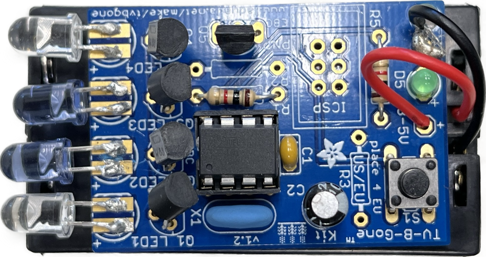

# **Mini Tank**



A tank for the average household, as helpful to you as the M-1 Abrams is to the average soldier. Controlled by a remote, it has the ability to follow your hand, avoid obstacles, follow a light source, and pick up items. It can do this using a suite of sensors, including an ultrasonic sensor, photoresistors, and an IR receiver. To pick things up, it has a robotic arm mounted to the rear, which is controlled by the same remote used to control the tank. The arm can swivel around and pick up any small items like a TV remote and bring them to you. The arm uses four servo motors to allow for a full 360 degrees of reach. The brains of this entire operation are actually split in two; the main tank uses an Arduino UNO, and the arm uses a smaller Arduino NANO. 

| **Engineer** | **School** | **Area of Interest** | **Grade** |
|:--:|:--:|:--:|:--:|
| Pravar K | Thomas Jefferson High School for Science and Technology | Mechanical Engineering | Rising Junior

## **Modifications**
<iframe width="560" height="315" src="https://www.youtube.com/embed/eBh0-jpoyQU" title="YouTube video player" frameborder="0" allow="accelerometer; autoplay; clipboard-write; encrypted-media; gyroscope; picture-in-picture; web-share" allowfullscreen></iframe>

This final milestone includes all the modifications done to the robot outside of its stock form. Now, the tank has a separate robotic arm attached to its rear which allows it to move around and pick up fallen objects to bring them back to the operator as well as a shell for the tank tracks to make it look more rugged. Attaching the robotic arm meant that a separate trailer arm was  CAD modeled as well as some caster wheels ordered to sit under the arm to allow the tank to move unimpeded. The final product is now fully controlled by the IR remote, which means that it can move around by itself and pick up objects. The arm, similar to the tank, is controlled by an Arduino NANO, which runs 4 servos which each operate one pivot point of the arm. At the bottom is a servo to allow the arm to twist from side to side, next are two servos which are the main and secondary pivots, respectively, and finally a servo to control the operation of the claw, opening and closing it on command. 


One of the biggest challenges I faced while finishing this last part of my build was coding the arm to work with the IR remote. Initially, it worked using a joystick controller, which relied on a very different method of control than the IR remote. At first, I tried to modify the original code to work using a remote but soon realized that it would be better to code something completely new. This meant learning a lot about servo movement and operation, as well as going more in-depth into C++ and using many complicated functions and libraries in order to achieve my goal. While working on this, I also came to the realization that the servos originally provided with the kit were not as strong as I wanted them to be, so I had to replace them with more capable servos in order to lift things slightly heavy items -- I used my AirPods for reference. 


Over these weeks spent at BSE, I learned many new topics and creative thinking skills to help further my pursuit in my chosen field of mechanical engineering. I had to learn a lot about Arduino programming using C++, as well as the mechanical side of things which involved retrofitting new components to existing models and using CAD software to create custom parts. Moving forward, in regard to my project, I am considering adding a camera to the front of the tank which will live-stream video to a device. This will allow me to control the robot from anywhere even when I can't see it, greatly increasing its usefulness.  

## **Milestone Three**
<iframe width="520" height="293" src="https://www.youtube.com/embed/d-ae45pgoyI" title="YouTube video player" frameborder="0" allow="accelerometer; autoplay; clipboard-write; encrypted-media; gyroscope; picture-in-picture; web-share" allowfullscreen></iframe>

The third milestone represents the full completion of the stock project. This means full movement (achieved in the previous milestone) and full functionality of all the sensors on board. The tank is now able to be controlled by both Bluetooth and IR remote, and is capable of avoiding obstacles, following obstacles, following light, and displaying messages on the LED screen mounted to the front. The sensors are used as follows: 


**IR Reciever:**  
The IR receiver is used to control the movements and features of the robot via a remote. The remote consists of four directional buttons, one "OK" button, and a number pad including "✱" and "**#**". To control the movement of the tank, the four directional buttons are used, up(forward), down(reverse), left, and right. The "OK" button is a full stop and stops both the motors as well as stopping any ongoing actions such as object following, obstacle avoidance, or light following. These features are controlled by the "✱", "0", and the "**#**" buttons, respectively. 


**Ultrasonic:**  
The ultrasonic sensor is used for both the object following and obstacle avoidance features. The former works as such: when the ultrasonic sensor detects an object in front of it, it will follow it. If the distance between the object and the robot is between 20 and 60 centimeters, the robot will move forward. If it's between 10 to 20 centimeters, the robot will stop, and anything less than 10 centimeters makes the robot reverse. If the robot does not detect anything in front of it (distance > 60cm) then it will stop, moving only when it detects an object. Object avoidance uses a servo motor in conjunction with the main ultrasonic sensor; the sensor is attached to the servo, which means that it can pivot and "look" around the robot at various angles in order to spot either a clear path or another obstacle. The robot will keep moving forward until it detects an obstacle in front of it. When that occurs, the servo turns the ultrasonic sensor left and right in order to spot a path. When it does, the robot will turn until it is facing the clear path, and then move forward until it detects an obstacle, where this process repeats. If both the left and right sides are blocked, the robot chooses a random direction and goes that way until it's met with an obstacle, where it repeats this process. Since the robot detects objects up to 60 centimeters away, turning in a random direction forces it towards the object, where it stops 20 cm away. Then, when it repeats the original process, it has a higher likelihood of finding a clear path. 


**Photoresistor:**  
The photoresistors are used for the light-follow feature. If both pick up bright light (returning a value greater than 650), the robot moves forward. If one picks up brighter light than the other, it will turn towards the light source (the photoresistor that picks up the brighter light) until both photoresistors receive the same amount of light, when it moves forward. If neither one returns a value greater than 650, the robot will stop moving until that changes.


One of the biggest challenges I faced while building this robot was getting the IR remote to work with the robot. The main problem was that the Arduino library for this specific remote didn't exist within the IDE, which meant I had to upload the custom library to the IDE. Since this library wasn't native to the Arduino IDE software, I added the file directly to the Arduino library folder instead of uploading it to the software the intended way. This allowed the Arduino to recognize the different button presses, which meant I could map them to their respective functions. Next, I plan to modify this robot to include a remote-controlled robotic arm attached to it so that it could pick up objects in order to be more useful in my daily life. I am also looking at increasing the speed of the robot since it is currently very slow. A possible cosmetic modification could be to 3D-print a shell that covers the tank tracks to make it look more rugged. Some key topics that I learned about while building this robot were Arduino programming, component wiring, troubleshooting, and debugging.


## **Milestone Two**
<iframe width="520" height="293" src="https://www.youtube.com/embed/A6prT1Q4WG4" title="YouTube video player" frameborder="0" allow="accelerometer; autoplay; clipboard-write; encrypted-media; gyroscope; picture-in-picture; web-share" allowfullscreen></iframe>

My second milestone with the mini tank robot is achieving full movement. This means both my motors operate as intended; in both directions and at different speeds. My goal for the movement was for the robot to move fully by itself and be controlled remotely. I had a choice between using a physical remote to control my robot and using an app on my phone, and I chose my phone as the remote, which meant using the Bluetooth module (TI HM-10). The code maps the button presses on my phone to the correct functions that make the robot move, as well as displays an animation on the 8x16 LED panel bolted to the front of the robot. When the "forward" button is pressed, both motors engage at full speed in the same direction, when the "back" button is pressed, the same happens, but in the opposite direction. In order to turn - since the tracks themselves don't steer - the left and right tracks are spun in opposite directions; right going forward turns left, and vice versa. 

## **Milestone One**

<iframe width="520" height="293" src="https://www.youtube.com/embed/kTaH7wy5VD0" title="YouTube video player" frameborder="0" allow="accelerometer; autoplay; clipboard-write; encrypted-media; gyroscope; picture-in-picture; web-share" allowfullscreen></iframe>

My first milestone with this project is finishing its assembly. The tank is built around a metal chassis to which the motors and the battery holder are connected. Four standoffs bolt into the center of the chassis, on top of which rests an acrylic plate that is home to the rest of the electronics. Standoffs rise from this acrylic plate to a servo motor attached to the ultrasonic sensor. Also attached to this acrylic plate are the Arduino, one IR receiver, and two photocell sensors. Dropping down the front of the robot attached to the acrylic plate is an 8x16 LED panel. Bolted to the chassis are two free-spinning wheels, which are connected to the driving wheels by plastic tank tracks. The wires from the motors and battery holder are wired into the motor shield, while the rest of the components connect to the topmost sensor shield. Overall, the cable management on this robot is fairly neat and does not obstruct the function of any of the components. 

## **Code for Full Tank Operation:**

```
    #include <IRremoteTank.h>
    int RECV_PIN = A0;       
    IRrecv irrecv(RECV_PIN);   
    decode_results results;
      
    //Array, used to store the data of the pattern, can be calculated by yourself or obtained from the modulus tool
    unsigned char start01[] = {0x01,0x02,0x04,0x08,0x10,0x20,0x40,0x80,0x80,0x40,0x20,0x10,0x08,0x04,0x02,0x01};
    unsigned char front[] = {0x00,0x00,0x00,0x00,0x00,0x24,0x12,0x09,0x12,0x24,0x00,0x00,0x00,0x00,0x00,0x00};
    unsigned char back[] = {0x00,0x00,0x00,0x00,0x00,0x24,0x48,0x90,0x48,0x24,0x00,0x00,0x00,0x00,0x00,0x00};
    unsigned char left[] = {0x00,0x00,0x00,0x00,0x00,0x00,0x44,0x28,0x10,0x44,0x28,0x10,0x44,0x28,0x10,0x00};
    unsigned char right[] = {0x00,0x10,0x28,0x44,0x10,0x28,0x44,0x10,0x28,0x44,0x00,0x00,0x00,0x00,0x00,0x00};
    unsigned char STOP01[] = {0x2E,0x2A,0x3A,0x00,0x02,0x3E,0x02,0x00,0x3E,0x22,0x3E,0x00,0x3E,0x0A,0x0E,0x00};
    unsigned char clear[] = {0x00,0x00,0x00,0x00,0x00,0x00,0x00,0x00,0x00,0x00,0x00,0x00,0x00,0x00,0x00,0x00};
    #define SCL_Pin  A5  //Set clock pin to A5
    #define SDA_Pin  A4  //Set data pin to A4
    
    #define ML_Ctrl 13  //define direction control pin of left motor
    #define ML_PWM 11   //define PWM control pin of left motor
    #define MR_Ctrl 12  //define direction control pin of right motor
    #define MR_PWM 3   //define PWM control pin of right motor
    
    #define Trig 5  //ultrasonic trig Pin
    #define Echo 4  //ultrasonic echo Pin
    int distance; //save the distance value detected by ultrasonic, follow function
    int random2; //save the variable of random numberssave the variable of random numbers
    //save the distance value detected by ultrasonic, obstacle avoidance function
    int a;  
    int a1;
    int a2;
    
    #define servoPin 9  //servo Pin
    int pulsewidth;
    
    #define light_L_Pin A1   //define the pin of left photo resistor sensor
    #define light_R_Pin A2   //define the pin of right photo resistor sensor
    int left_light;
    int right_light;
    
    // char bluetooth_val; //save the value of Bluetooth reception
    int flag;  //flag variable, it is used to entry and exist function
    void setup(){
    Serial.begin(9600);
    irrecv.enableIRIn(); // Initialize the IR receiver 
    
    pinMode(Trig, OUTPUT);
    pinMode(Echo, INPUT);
    pinMode(ML_Ctrl, OUTPUT);
    pinMode(ML_PWM, OUTPUT);
    pinMode(MR_Ctrl, OUTPUT);
    pinMode(MR_PWM, OUTPUT);
    
    pinMode(servoPin, OUTPUT);
    procedure(70); //set servo to 90°
    pinMode(SCL_Pin,OUTPUT);
    pinMode(SDA_Pin,OUTPUT);
    matrix_display(clear);    //Clear the display
    matrix_display(start01);  //display start pattern
    pinMode(light_L_Pin, INPUT);
    pinMode(light_R_Pin, INPUT);
    }
    
    void loop(){
    if (irrecv.decode(&results)) {
    if(results.value==0xFF629D) //FRONT
    {
    Car_front();
    matrix_display(front);  //display forward pattern
    }
    else if(results.value==0xFFA857) //BACK
    {
    Car_back();
    matrix_display(back);  // display back pattern
    }
    
    else if(results.value==0xFF22DD) //LEFT
    {
    Car_left();
    matrix_display(left);  //show left-turning pattern
    }
    
    else if(results.value==0xFFC23D) //RIGHT
    {
    Car_right();
    matrix_display(right);  //show right-turning pattern
    }
    
    else if(results.value==0xFF02FD) //STOP
    {
    Car_Stop();
    matrix_display(STOP01);  //display stop pattern
    }
    else if(results.value==0xFF42BD) //FOLLOW OBJ
    {
    matrix_display(start01);  
    follow();
    }
    
    else if(results.value==0xFF4AB5) //AVOID OBJ
    {
    matrix_display(start01);  
    avoid();
    }
    
    else if(results.value==0xFF52AD) //LIGHT FOLLOW
    {
    matrix_display(start01);  
    light_track();
    }
    irrecv.resume(); //receive the next value
    }
    }
    /*****************Obstacle Avoidance Function**************/
    void avoid() 
    {
    flag = 0;  //the design that enter obstacle avoidance function
    while (flag == 0) 
    {
    random2 = random(1, 100);
    a = checkdistance();  //assign the front distance detected by ultrasonic sensor to variable a
    
    if (a < 20) //when the front distance detected is less than 20cm
    {
    Car_Stop();  //robot stops
    delay(200); //delay in 200ms
    
    procedure(160);  //Ultrasonic platform turns left
    for (int j = 1; j <= 10; j = j + (1)) { ///for statement, the data will be more accurate if ultrasonic sensor detect a few times.
    a1 = checkdistance();  //assign the left distance detected by ultrasonic sensor to variable a1
    }
    delay(200);
    procedure(20); //Ultrasonic platform turns right
    for (int k = 1; k <= 10; k = k + (1)) {
    a2 = checkdistance(); //assign the right distance detected by ultrasonic sensor to variable a2
    }
    if (a1 < 50 || a2 < 50)  //robot will turn to the longer distance side when left or right distance is less than 50cm.if the left or right distance is less than 50cm,
    the robot will turn to the greater distance
    {
    if (a1 > a2) //left distance is greater than right
    {
    procedure(90);  //Ultrasonic platform turns back to right ahead ultrasonic platform turns front
    Car_left();  //robot turns left
    delay(500);  //turn left 500ms
    Car_front(); //go forward
    } 
    else 
    {
    procedure(90);
    Car_right(); //robot turns right
    delay(500);
    Car_front();  //go forward
    }
    } 
    else  //both distance on two side is greater than or equal to 50cm, turn randomly
    {
    if ((long) (random2) % (long) (2) == 0)  //when the random number is even
    {
    procedure(90);
    Car_left(); //robot turns left
    delay(500);
    Car_front(); //go forward
    } 
    else 
    {
    procedure(90);
    Car_right(); //robot turns right
    delay(500);
    Car_front(); ///go forward
    } } } 
    else  //If the front distance is greater than or equal to 20cm, robot car will go front
    {
    Car_front(); //go forward
    }
    // receive the input to end the obstacle avoidance function
    if (irrecv.decode(&results)) {
    if(results.value==0xFF02FD)
    {
    flag = 1;  //when assign 1 to flag, end loop
    }
    irrecv.resume(); //receive the next value
    }}}
    /*******************Follow****************/
    void follow() {
    flag = 0;
    while (flag == 0) {
    distance = checkdistance();  //assign the distance detected by ultrasonic sensor to distance
    if (distance >= 20 && distance <= 60) //the range to go front
    {
    Car_front();
    }
    else if (distance > 10 && distance < 20)  //the range to stop
    {
    Car_Stop();
    }
    else if (distance <= 10)  // the range to go back
    {
    Car_back();
    }
    else  //other situations, stop
    {
    Car_Stop();
    }
    // if (Serial.available())
    // {
    //   bluetooth_val = Serial.read();
    //   if (bluetooth_val == 'S') 
    //   {
    //     flag = 1;  //end loop
    //   }}
    if (irrecv.decode(&results)) {
    if(results.value==0xFF02FD)
    {
    flag = 1;  //when assign 1 to flag, end loop
    }
    irrecv.resume(); //receive the next value
    }}}
    //The function to control ultrasonic sensor 
    float checkdistance() {
    digitalWrite(Trig, LOW);
    delayMicroseconds(2);
    digitalWrite(Trig, HIGH);
    delayMicroseconds(10);
    digitalWrite(Trig, LOW);
    float distance = pulseIn(Echo, HIGH) / 58.00;  //58.20 means 2*29.1=58.2
    delay(10);
    return distance;
    }
    //The function to control servo the function controlling servo
    void procedure(int myangle) {
    for (int i = 0; i <= 50; i = i + (1)) {
    pulsewidth = myangle * 11 + 500;
    digitalWrite(servoPin,HIGH);
    delayMicroseconds(pulsewidth);
    digitalWrite(servoPin,LOW);
    delay((20 - pulsewidth / 1000));
    }}
    
    /****************Light Follow******************/
    void light_track() {
    flag = 0;
    while (flag == 0) {
    left_light = analogRead(light_L_Pin);
    right_light = analogRead(light_R_Pin);
    if (left_light > 650 && right_light > 650) //the value detected by photo resistor, go forward
    {  
    Car_front();
    } 
    else if (left_light > 650 && right_light <= 650)  //the value detected by photo resistor, turn left
    {
    Car_left();
    } 
    else if (left_light <= 650 && right_light > 650) //the value detected by photo resistor, turn right
    {
    Car_right();
    } 
    else  //other situations, stop
    {
    Car_Stop();
    }
    if (irrecv.decode(&results)) {
    if(results.value==0xFF02FD)
    {
    flag = 1;  //when assign 1 to flag, end loop
    }
    irrecv.resume(); //receive the next value
    }}}
    /***************Dot Matrix *****************/
    // this function is used for dot matrix display 
    void matrix_display(unsigned char matrix_value[])
    {
    IIC_start();
    IIC_send(0xc0);  //Choose address
    
    for(int i = 0;i < 16;i++) //pattern data has 16 bits
    {
    IIC_send(matrix_value[i]); //convey the pattern data
    }
    IIC_end();   //end the transmission of pattern data
    IIC_start();
    IIC_send(0x8A);  //display control, set pulse width to 4/16
    IIC_end();
    }
    //The condition starting to transmit data
    void IIC_start()
    {
    digitalWrite(SCL_Pin,HIGH);
    delayMicroseconds(3);
    digitalWrite(SDA_Pin,HIGH);
    delayMicroseconds(3);
    digitalWrite(SDA_Pin,LOW);
    delayMicroseconds(3);
    }
    //convey data
    void IIC_send(unsigned char send_data)
    {
    for(char i = 0;i < 8;i++)  //each byte has 8 bits
    {
    digitalWrite(SCL_Pin,LOW);  //pull down clock pin SCL Pin to change the signals of SDA
    delayMicroseconds(3);
    if(send_data & 0x01)  //set high and low level of SDA_Pin according to 1 or 0 of every bit
    {
    digitalWrite(SDA_Pin,HIGH);
    }
    else
    {
    digitalWrite(SDA_Pin,LOW);
    }
    delayMicroseconds(3);
    digitalWrite(SCL_Pin,HIGH); //pull up clock pin SCL_Pin to stop transmitting data
    delayMicroseconds(3);
    send_data = send_data >> 1;  // detect bit by bit, so move the data right by one
    }}
    //The sign that data transmission ends
    void IIC_end()
    {
    digitalWrite(SCL_Pin,LOW);
    delayMicroseconds(3);
    digitalWrite(SDA_Pin,LOW);
    delayMicroseconds(3);
    digitalWrite(SCL_Pin,HIGH);
    delayMicroseconds(3);
    digitalWrite(SDA_Pin,HIGH);
    delayMicroseconds(3);
    }
    /*************the function to run motor*************/
    
    // moves both motors full speed forward
    void Car_front()
    {
    digitalWrite(MR_Ctrl,LOW);
    analogWrite(MR_PWM,200);
    digitalWrite(ML_Ctrl,LOW);
    analogWrite(ML_PWM,200);
    }
    
    // moves both motors full speed backward
    void Car_back()
    {
    digitalWrite(MR_Ctrl,HIGH);
    analogWrite(MR_PWM,200);
    digitalWrite(ML_Ctrl,HIGH);
    analogWrite(ML_PWM,200);
    }
    
    // moves both motors full speed, but right motor goes forward while left motor goes backward
    void Car_left()
    {
    digitalWrite(MR_Ctrl,LOW);
    analogWrite(MR_PWM,255);
    digitalWrite(ML_Ctrl,HIGH);
    analogWrite(ML_PWM,255);
    }
    
    // // moves both motors full speed, but left motor goes forward while right motor goes backward
    void Car_right()
    {
    digitalWrite(MR_Ctrl,HIGH);
    analogWrite(MR_PWM,255);
    digitalWrite(ML_Ctrl,LOW);
    analogWrite(ML_PWM,255);
    }
    
    // stops both motors by setting speed to 0 
    void Car_Stop()
    {
    digitalWrite(MR_Ctrl,LOW);
    analogWrite(MR_PWM,0);
    digitalWrite(ML_Ctrl,LOW);
    analogWrite(ML_PWM,0);
    } 
```


## **Code for Full Arm Operation:**

``` 
#include <IRremote.h>
#include <Servo.h>

// IR module initialization
int RECV_PIN = 8;
IRrecv irrecv(RECV_PIN);
decode_results results;

Servo bottomServo;     //bottom servo Pin
Servo mainPivot;       //main pivot servo Pin
Servo secondaryPivot;  //secondary pivot servo Pin
Servo clawServo;       //claw servo Pin

void setup() {
  Serial.begin(9600);
  irrecv.enableIRIn();  // Initialize the IR receiver

  //Servo pin definition
  bottomServo.attach(4);
  mainPivot.attach(5);
  secondaryPivot.attach(6);
  clawServo.attach(7);

  // setting all servos to 90 degrees
  bottomServo.write(90);
  mainPivot.write(90);
  secondaryPivot.write(90);
  clawServo.write(90);
  delay(1000);
}

void loop() {
  // mapping remote button presses to servo movement functions
  if (irrecv.decode()) {
    if (irrecv.decodedIRData.decodedRawData == 3810328320)  // bottom servo right
    {
      bottomServo_right();
    } else if (irrecv.decodedIRData.decodedRawData == 4144561920)  // bottom servo left
    {
      bottomServo_left();
    }

    else if (irrecv.decodedIRData.decodedRawData == 3910598400)  // main pivot forward
    {
      mainPivot_forward();
    }

    else if (irrecv.decodedIRData.decodedRawData == 4077715200)  // main pivot backward
    {
      mainPivot_back();
    }

    else if (irrecv.decodedIRData.decodedRawData == 3860463360)  // secondary pivot forward
    {
      secondaryPivot_forward();
    }

    else if (irrecv.decodedIRData.decodedRawData == 3877175040)  // secondary pivot backward
    {
      secondaryPivot_back();
    }

    else if (irrecv.decodedIRData.decodedRawData == 4061003520)  // claw open
    {
      claw_open();
    }

    else if (irrecv.decodedIRData.decodedRawData == 2707357440)  // claw close
    {
      claw_close();
    }

    irrecv.resume();  //receive the next value
  }
}

//******************SERVO MOVEMENT FUNCTIONS******************//
// runs an infinite for loop to slowly change the angle of each servo until "9" is pressed, which stops the for loop

// Function to twist the bottom servo to the right
void bottomServo_right() {
  int bR = bottomServo.read();                                  // Read the current position of the bottom servo
  for (bR <= 180; bR += 1;) {                                   // Loop to increment the position from current to 180 degrees
    if (irrecv.decode()) {                                      // Check if an infrared signal is received
      if (irrecv.decodedIRData.decodedRawData == 2774204160) {  // Check if the received signal matches a specific value
        break;                                                  // If the signal matches, exit the loop
      }
      irrecv.resume();  // Resume receiving infrared signals
    }
    bottomServo.write(bR);  // Set the bottom servo position to the current value
    delay(15);              // Delay for stability
  }
}

// Function to twist the bottom servo to the left
void bottomServo_left() {
  int bR = bottomServo.read();                                  // Read the current position of the bottom servo
  for (bR <= 180; bR -= 1;) {                                   // Loop to decrement the position from current to 0 degrees
    if (irrecv.decode()) {                                      // Check if an infrared signal is received
      if (irrecv.decodedIRData.decodedRawData == 2774204160) {  // Check if the received signal matches a specific value
        break;                                                  // If the signal matches, exit the loop
      }
      irrecv.resume();  // Resume receiving infrared signals
    }
    bottomServo.write(bR);  // Set the bottom servo position to the current value
    delay(15);              // Delay for stability
  }
}

// Function to move the main pivot forward
void mainPivot_forward() {
  int mP = mainPivot.read();                                    // Read the current position of the main pivot
  for (mP <= 180; mP -= 1;) {                                   // Loop to decrement the position from current to 0 degrees
    if (irrecv.decode()) {                                      // Check if an infrared signal is received
      if (irrecv.decodedIRData.decodedRawData == 2774204160) {  // Check if the received signal matches a specific value
        break;                                                  // If the signal matches, exit the loop
      }
      irrecv.resume();  // Resume receiving infrared signals
    }
    mainPivot.write(mP);  // Set the main pivot position to the current value
    delay(15);            // Delay for stability
  }
}

// Function to move the main pivot backward
void mainPivot_back() {
  int mP = mainPivot.read();                                    // Read the current position of the main pivot
  for (mP <= 180; mP += 1;) {                                   // Loop to increment the position from current to 180 degrees
    if (irrecv.decode()) {                                      // Check if an infrared signal is received
      if (irrecv.decodedIRData.decodedRawData == 2774204160) {  // Check if the received signal matches a specific value
        break;                                                  // If the signal matches, exit the loop
      }
      irrecv.resume();  // Resume receiving infrared signals
    }
    mainPivot.write(mP);  // Set the main pivot position to the current value
    delay(15);            // Delay for stability
  }
}

// Function to move the secondary pivot forward
void secondaryPivot_forward() {
  int sP = secondaryPivot.read();                               // Read the current position of the secondary pivot
  for (sP <= 180; sP += 1;) {                                   // Loop to increment the position from current to 180 degrees
    if (irrecv.decode()) {                                      // Check if an infrared signal is received
      if (irrecv.decodedIRData.decodedRawData == 2774204160) {  // Check if the received signal matches a specific value
        break;                                                  // If the signal matches, exit the loop
      }
      irrecv.resume();  // Resume receiving infrared signals
    }
    secondaryPivot.write(sP);  // Set the secondary pivot position to the current value
    delay(15);                 // Delay for stability
  }
}

// Function to move the secondary pivot backward
void secondaryPivot_back() {
  int sP = secondaryPivot.read();                               // Read the current position of the secondary pivot
  for (sP <= 180; sP -= 1;) {                                   // Loop to decrement the position from current to 0 degrees
    if (irrecv.decode()) {                                      // Check if an infrared signal is received
      if (irrecv.decodedIRData.decodedRawData == 2774204160) {  // Check if the received signal matches a specific value
        break;                                                  // If the signal matches, exit the loop
      }
      irrecv.resume();  // Resume receiving infrared signals
    }
    secondaryPivot.write(sP);  // Set the secondary pivot position to the current value
    delay(15);                 // Delay for stability
  }
}

// Function to open the claw
void claw_open() {
  int c = clawServo.read();                                     // Read the current position of the claw servo
  for (c >= 0; c -= 1;) {                                       // Loop to decrement the position from current to 0 degrees
    if (irrecv.decode()) {                                      // Check if an infrared signal is received
      if (irrecv.decodedIRData.decodedRawData == 2774204160) {  // Check if the received signal matches a specific value
        break;                                                  // If the signal matches, exit the loop
      }
      irrecv.resume();  // Resume receiving infrared signals
    }
    clawServo.write(c);  // Set the claw servo position to the current value
    delay(15);           // Delay for stability
  }
}

// Function to close the claw
void claw_close() {
  int c = clawServo.read();                                     // Read the current position of the claw servo
  for (c >= 0; c += 1;) {                                       // Loop to increment the position from current to 180 degrees
    if (irrecv.decode()) {                                      // Check if an infrared signal is received
      if (irrecv.decodedIRData.decodedRawData == 2774204160) {  // Check if the received signal matches a specific value
        break;                                                  // If the signal matches, exit the loop
      }
      irrecv.resume();  // Resume receiving infrared signals
    }
    clawServo.write(c);  // Set the claw servo position to the current value
    delay(15);           // Delay for stability
  }
}
      
``` 

### [Assembly Guide for Mini Tank](https://wiki.keyestudio.com/Ks0428_keyestudio_Mini_Tank_Robot_V2)

### [Assemebly Guide for Robotic Arm](https://github.com/Cokoino/CKK0006)

## **Bill of Materials**

### **Tank**

| **Part**                               | **Purpose**                                          | **Link to Buy**                                                                                                             | **Price** |
| ---------------------------------- | ---------------------------------------------- | -------------------------------------------------------------------------------------------------------------------- | -------------- |
| Arduino Uno R3 board                | Microcontroller for controlling the robot         | [UNO](https://www.keyestudio.com/products/keyestudio-uno-r3-atmega328p-development-board-usb-cable-for-arduino) | $14.46         |
| Keyestudio Motor Shield           | Motor driver board for controlling the motors    | [Motor Shield](https://www.keyestudio.com/products/keyestudio-4wd-tb6612-motor-driver-shield-black-and-eco-friendly) | $25.00         |
| Keyestudio Sensor Shield         | Sensor Driver board to control sensors         | [Sensor Shield](https://www.keyestudio.com/products/free-shipping-keyestudio-sensor-shield-expansion-board-v5-for-arduino-1) | $6.10          |
| Ultrasonic sensor module SR01 | Obstacle detection and avoidance             | [SR01](https://www.keyestudio.com/products/keyestudio-sr01-ultrasonic-sensor-module-v2-n76e003at20-for-arduino-robot-car) | $7.40          |
| Keyestudio HM-10 Bluetooth-4.0 V2 module For Arduino | Wireless communication with smartphone/computer | [HM-10](https://www.keyestudio.com/products/keyestudio-hm-10-bluetooth-40-v2-module-for-arduino) | $7.80          |
| 2 x DC gear motors                  | Provides locomotion to the robot                     | [DC Motors](https://www.amazon.com/Greartisan-Electric-Reduction-Centric-Diameter/dp/B072R57C56/ref=sr_1_16?crid=338834IK8E9QL&keywords=dc%2Bgear%2Bmotor%2Bkeyestudio&qid=1689709200&sprefix=dc%2Bgear%2Bmotor%2Bkeyestudi%2Caps%2C123&sr=8-16&th=1) | $14.99         |
| 4 x Wheels                             | Attaches to the motors for movement                 | N/A                                                                                                                              | N/A                |
| 2 x Tank Tracks                    | Wraps around wheels for movement                | N/A                                                                                                                              | N/A                |
| 1 x 9V battery holder              | Connects to battery to power the Arduino board | [Battery Holder 9V](https://www.amazon.com/Battery-Connector-Plastic-Experiment-Equipment/dp/B08SL9X2YC/ref=sr_1_5?keywords=9v+battery+holder&qid=1689709640&sr=8-5) | $4.99          |
| Jumper wires (male-to-male, male-to-female, female-to-female) | Connects various components         | [Jumper Wires](https://www.amazon.com/IZOKEE-Solderless-Breadboard-Arduino-Project/dp/B08151TQHG/ref=sr_1_3?keywords=jumper+wires&qid=1689719403&sr=8-3) | $8.99          |
| M3 & M2 screws, nuts, and standoff spacers                 | Secures components to the chassis                 | [M3,M2 Set](https://www.amazon.com/Hilitchi-Female-Spacer-Standoff-Assortment/dp/B01DXVKWYG/ref=sr_1_3?crid=18ZDEMI82VMCJ&keywords=m3+and+m2+screws+and+nuts+and+standoffs&qid=1689719527&sprefix=m3+and+m2+screws+and+nuts+and+standof%2Caps%2C149&sr=8-3) | $11.98         |
| 9V Battery                            | Powers Arduino                                           | [Battery](https://www.amazon.com/Amazon-Basics-Performance-All-Purpose-Batteries/dp/B0774D64LT/ref=zg_bs_g_389576011_sccl_1/134-4404331-2282664?th=1) | $9.99          |

### **Arm**

| **Part**                              | **Purpose**                                        | **Link to Buy** | **Price** |
| --------------------------------- | ---------------------------------------------- | --------------------- | -------------- |
| Arduino NANO | Used to control 4 arm servos and IR receiver | [Arduino NANO](https://www.amazon.com/Arduino-Nano-RP2040-Connect-Headers/dp/B095J4KFVT/ref=sr_1_4?crid=3VNEJAVM2ESD2&keywords=arduino+nano+cocolino&qid=1689719826&sprefix=arduino+nano+cokoino%2Caps%2C129&sr=8-4) | $31.50 | 
| Arduino NANO screw terminal | Mounts the Arduino to the base | [NANO Terminal](https://www.amazon.com/Arduino-Terminal-Adapter-Single-ASX00037/dp/B0BQ7927LM/ref=sr_1_10?crid=3VNEJAVM2ESD2&keywords=arduino+nano+cocolino&qid=1689719826&sprefix=arduino+nano+cokoino%2Caps%2C129&sr=8-10) | $14.00 |
| M3 & M2 screws, nuts, and standoff spacers                | Secures components to the chassis               | [M3,M2 Set](https://www.amazon.com/Hilitchi-Female-Spacer-Standoff-Assortment/dp/B01DXVKWYG/ref=sr_1_3?crid=18ZDEMI82VMCJ&keywords=m3+and+m2+screws+and+nuts+and+standoffs&qid=1689719527&sprefix=m3+and+m2+screws+and+nuts+and+standof%2Caps%2C149&sr=8-3) | $11.98 |
| LK COKOINO Acrylic Structure | Body and structure of the arm | N/A | N/A |
| 3 x 7KG Servos | Powers the main movement of the arm (Pivot + Claw) | [Servos](https://www.amazon.com/INJORA-Digital-Waterproof-Voltage-Sub-Micro/dp/B0BLBMPVDV/ref=sr_1_4?crid=15WHO3VNS6Y53&keywords=micro%2Bservo&qid=1688427326&s=toys-and-games&sprefix=micro%2Bservo%2Ctoys-and-games%2C133&sr=1-4&th=1) | $47.99 | 
| MG90 9g Servo | Base of robot; allows robot to twist side to side | [Base Servo](https://www.amazon.com/Replace-Helicopter-Airplane-Controls-Vehicle/dp/B09KXM5L7Z/ref=sr_1_4?crid=3DJ65GX1TF7NM&keywords=MG90+1+pc&qid=1689720414&s=toys-and-games&sprefix=mg90+1+pc%2Ctoys-and-games%2C133&sr=1-4) | $8.49 |
| 1 x 9V battery holder             | Connects to battery to power the Arduino board   | [Battery Holder 9V](https://www.amazon.com/Battery-Connector-Plastic-Experiment-Equipment/dp/B08SL9X2YC/ref=sr_1_5?keywords=9v+battery+holder&qid=1689709640&sr=8-5) | $4.99 |
| Jumper wires (male-to-male, male-to-female, female-to-female) | Connects various components        | [Jumper Wires](https://www.amazon.com/IZOKEE-Solderless-Breadboard-Arduino-Project/dp/B08151TQHG/ref=sr_1_3?keywords=jumper+wires&qid=1689719403&sr=8-3) | $8.99 |
| 9V Battery | Powers Arduino | [Battery](https://www.amazon.com/Amazon-Basics-Performance-All-Purpose-Batteries/dp/B0774D64LT/ref=zg_bs_g_389576011_sccl_1/134-4404331-2282664?th=1) | $9.99 |


# **TV-B-Gone!**


<iframe width="520" height="293" src="https://www.youtube.com/embed/QaLAbvSM52E" title="YouTube video player" frameborder="0" allow="accelerometer; autoplay; clipboard-write; encrypted-media; gyroscope; picture-in-picture; web-share" allowfullscreen></iframe>  

  The TV-B-Gone is a small remote device that, with the press of a button, turns off any TV within a 150-foot radius. This remote consists of one  microcontroller, with five transistors, two 1.0Kohm resistors, three capacitors, and a battery holder for two AA batteries. The main parts are the four IR LEDs which broadcast the signal to turn off the TVs, the button used to turn on the IR LEDs, and an indicator LED that signals whether or not the device is turned on. Putting together this project involved placing and soldering all the components onto the circuit board, periodically testing that everything was working as intended. Once finished, a press of the button starts a broadcast of the most common IR codes for TVs in order to turn them off. 

| **Components list** | **Quantity** |
| -----------------| ----------------|
| IC1' 8-pin socket | 1 |    
| IC1 Microcontroller | 1 |
| XTL1 8.00 MHz ceramic oscillator | 1 |                                  
| C2 220uF capacitor | 1 |                                               
| C1	Ceramic 0.1uF capacitor (104) | 1 |
| R1, R5 1.0Kohm 1/4W 5% resistor | 2 |                                
| Narrow beam IR LED  | 2 |                                               
| Wide beam IR LED  | 2 |                                                 
| 3mm Green LED        | 1 |                                              
| SW1	6mm tact switch button    | 1 |                                    
| Q5	PNP transistor, EBC pinout        | 1 |                              
| Q1,2,3,4	NPN Transistor(TO-92) → 2N3904 EBC pinout | 4 |
| BATT	2x AA battery holder        | 1 |                                  
| AA Battery 1.5 V | 2 |                                                  
| PCB  | 1 |                                                              
